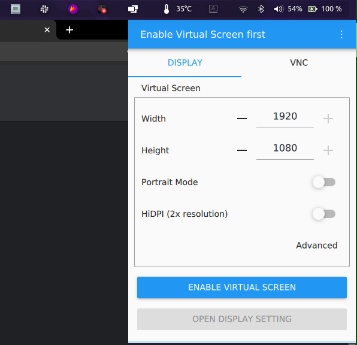
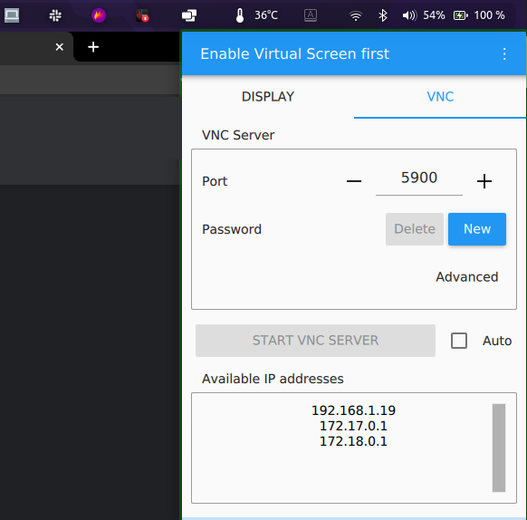

<h1 align="center">
    
</h1>

<h2 align="center">
  Virtual Display Linux and VirtScreen
</h2>

## 🚀 Tecnologias
Esse projeto foi desenvolvido com as seguintes tecnologias:
- [VirtScreen](https://github.com/kbumsik/VirtScreen)

## 💻 Projeto
**Possibilidade de usar tablet como segunda tela em dispositivo Linux**.

OBS: Não é possível utilizar em conjunto com um monitor no HDMI. É apenas um quebra-galho se não possuir outro monitor ou estiver viajando. Tenha isso em mente.

## Como rodar:
### 1 - Create Virtual Screens
Open terminal and run:
```shell
git clone https://github.com/andre23arruda/linux-tablet-screen

sudo chmod +x vdl-on
sudo chmod +x vdl-off

sudo ./vdl-on

# Reboot or relogin current session
```

### Download VirtScreen AppImage
- Download [VirtScreen.AppImage](https://github.com/kbumsik/VirtScreen/releases/download/0.3.1/VirtScreen.AppImage)
- Adicione __VirtScreen.AppImage__ na pasta __linux-tablet-screen__

### 2 - Enable virtual screen
After reboot or relogin, open terminal and run:
```shell
sudo ./vdl-on
# You can see a new monitor in Settings -> Displays

# open VirtScreen
export MESA_LOADER_DRIVER_OVERRIDE=i965;
./VirtScreen.AppImage
```

### 3 - VirtScreen
- Click in VirtScreen icon on topbar
- Config and enable virtual Display
<div align="center">
    
</div>
- Start VNC Server
<div align="center">
    
</div>

### 4 - bVNC
- Download [bVNC: Secure VNC Viewer](https://play.google.com/store/apps/details?id=com.iiordanov.freebVNC&hl=pt_BR&gl=US) in yout Android Tablet
- Add VNC Server host in new connection
- Enjoy your second screen!


### 5 - Não quer mais usar?
Open terminal and run:
```shell
sudo ./vdl-off

# Reboot or relogin current session
```
